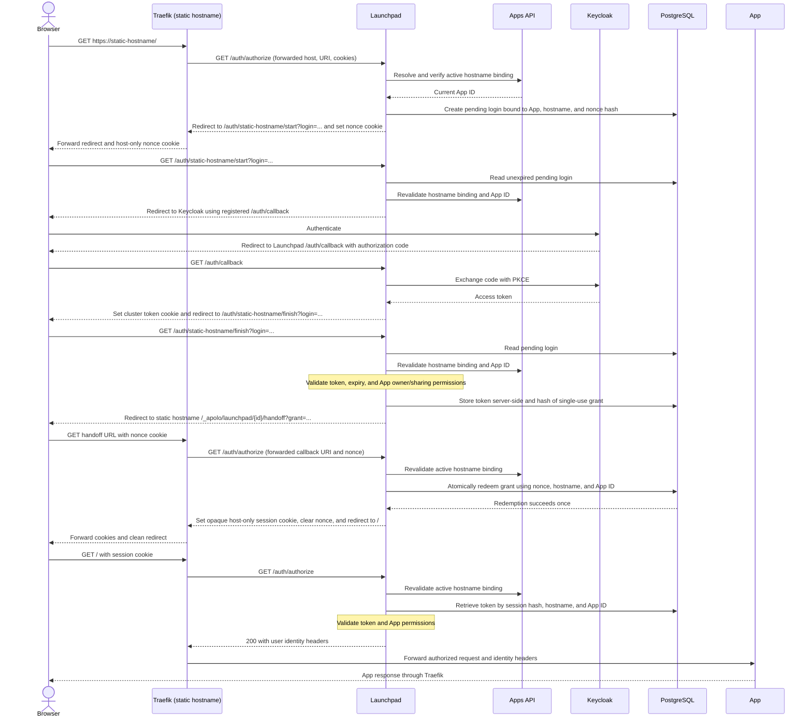

# Static hostname authentication

Launchpad resolves static hostnames through the Apps API's current binding and
applies the installed App's existing sharing and owner permissions. Detached,
inactive, or transferred bindings cannot authorize the previous App.

When a hostname is outside the cluster cookie domain, login starts on Launchpad's
own domain and uses the existing registered Keycloak callback. A nonce-bound,
single-use grant returns the browser to the hostname. Its `__Host-` session cookie
is opaque, Secure, HttpOnly, and host-only; access tokens remain in PostgreSQL.
Grants expire after one minute and sessions expire with their access tokens.
Logout revokes this user's issued alias grants and sessions across this Launchpad,
including sessions created by earlier logins. Expired records are removed when
another alias login starts.

The browser flow for a static hostname outside the cluster cookie domain is:

Static binding resolution uses two requests: resolve the instance by hostname,
then verify its exact active static-hostname binding. Locally registered hosts
also require a hostname-configuration lookup to distinguish static aliases from
ordinary App URLs. A 404 from that configuration view means static hostnames are
unconfigured; other failures deny authorization with 503. Cookie-domain coverage
determines token transport and does not control binding validation.

Hostnames are normalized consistently across registry, OAuth, local App, and
session lookups: case and trailing DNS dots are normalized, and the default HTTPS
port is omitted. Non-default ports remain part of App URLs and session bindings.
Noncanonical browser origins redirect to the canonical origin before any nonce
cookie is set, preserving the request path and query. This keeps host-only cookies
on the same origin used by the handoff callback.
Pending logins and their nonce cookies share a five-minute lifetime; grants expire
after at most one minute. PostgreSQL stores hashes of
login, nonce, grant, and session values, plus the server-side access token. Only the
opaque session cookie is sent to the static hostname after login.

Missing or inactive bindings, App changes during login, invalid permissions, and
invalid or replayed grants deny access with 403. Apps API lookup failures return
503. Normal requests recheck the current binding, so a session for the previous
App cannot authorize a hostname after it moves. Launchpad logout deletes the
user's issued grants and sessions; an existing alias cookie then has no valid
server-side session.

For deployment requirements and regression checks, see the [operations guide](../operations/static-hostname-authentication.md).

## Implementation boundaries

- [Static hostname HTTP routes](../../launchpad/auth/static_hostname_api.py) own the
  start and finish endpoints, handoff handling, redirects, and host-only cookies.
- [Static hostname authentication service](../../launchpad/auth/static_hostname.py)
  owns persisted login, grant, session, and revocation operations.
- [Shared authentication dependencies](../../launchpad/auth/dependencies.py) own
  App resolution, permission checks, and token decoding.
- [General authentication routes](../../launchpad/auth/api.py) orchestrate
  authorization and retain the token, callback, and logout endpoints.

The [root router](../../launchpad/api.py) includes both authentication routers under
`/auth`, preserving the public endpoint paths.
